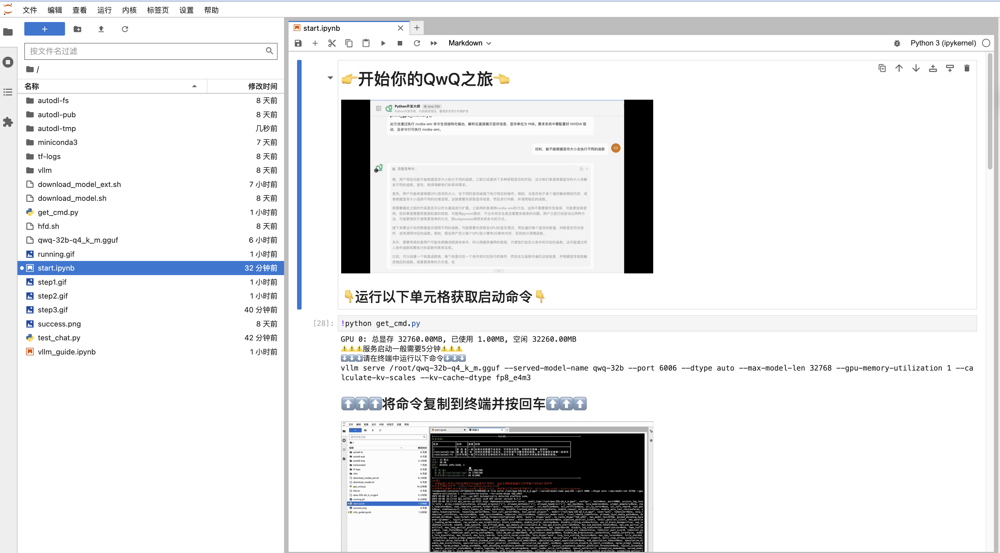

# QwQ-32B

<a href="https://chat.qwenlm.ai/" target="_blank" style="margin: 2px;">
    
</a>

## 快速开始
###  AutoDL镜像[全站首发，一键部署QwQ](https://www.codewithgpu.com/i/jsntcheng/QwQ-32B/Qwen_QwQ-32B_Q4_K_M)<p align="center">
  
</p>
## Introduction

QwQ is the reasoning model of the Qwen series. Compared with conventional instruction-tuned models, QwQ, which is capable of thinking and reasoning, can achieve significantly enhanced performance in downstream tasks, especially hard problems. QwQ-32B is the medium-sized reasoning model, which is capable of achieving competitive performance against state-of-the-art reasoning models, e.g., DeepSeek-R1, o1-mini.

<p align="center">
  
</p>


**This repo contains the QwQ 32B model**, which has the following features:
- Type: Causal Language Models
- Training Stage: Pretraining & Post-training (Supervised Finetuning and Reinforcement Learning)
- Architecture: transformers with RoPE, SwiGLU, RMSNorm, and Attention QKV bias
- Number of Parameters: 32.5B
- Number of Paramaters (Non-Embedding): 31.0B
- Number of Layers: 64
- Number of Attention Heads (GQA): 40 for Q and 8 for KV
- Context Length: Full 131,072 tokens

**Note:** For the best experience, please review the [usage guidelines](#usage-guidelines) before deploying QwQ models.

You can try our [demo](https://huggingface.co/spaces/Qwen/QwQ-32B-Demo) or access QwQ models via [QwenChat](https://chat.qwen.ai).

For more details, please refer to our [blog](https://qwenlm.github.io/blog/qwq-32b/), [GitHub](https://github.com/QwenLM/Qwen2.5), and [Documentation](https://qwen.readthedocs.io/en/latest/).

## Requirements

QwQ is based on Qwen2.5, whose code has been in the latest Hugging face `transformers`. We advise you to use the latest version of `transformers`.

With `transformers<4.37.0`, you will encounter the following error:
```
KeyError: 'qwen2'
```

## Quickstart

Here provides a code snippet with `apply_chat_template` to show you how to load the tokenizer and model and how to generate contents.

```python
from transformers import AutoModelForCausalLM, AutoTokenizer

model_name = "Qwen/QwQ-32B"

model = AutoModelForCausalLM.from_pretrained(
    model_name,
    torch_dtype="auto",
    device_map="auto"
)
tokenizer = AutoTokenizer.from_pretrained(model_name)

prompt = "How many r's are in the word \"strawberry\""
messages = [
    {"role": "user", "content": prompt}
]
text = tokenizer.apply_chat_template(
    messages,
    tokenize=False,
    add_generation_prompt=True
)

model_inputs = tokenizer([text], return_tensors="pt").to(model.device)

generated_ids = model.generate(
    **model_inputs,
    max_new_tokens=32768
)
generated_ids = [
    output_ids[len(input_ids):] for input_ids, output_ids in zip(model_inputs.input_ids, generated_ids)
]

response = tokenizer.batch_decode(generated_ids, skip_special_tokens=True)[0]
print(response)
```

### Usage Guidelines

To achieve optimal performance, we recommend the following settings:

1. **Enforce Thoughtful Output**: Ensure the model starts with "\<think\>\n" to prevent generating empty thinking content, which can degrade output quality. If you use `apply_chat_template` and set `add_generation_prompt=True`, this is already automatically implemented, but it may cause the response to lack the \<think\> tag at the beginning. This is normal behavior.

2. **Sampling Parameters**:
   - Use Temperature=0.6 and TopP=0.95 instead of Greedy decoding to avoid endless repetitions.
   - Use TopK between 20 and 40 to filter out rare token occurrences while maintaining the diversity of the generated output.

3. **Standardize Output Format**: We recommend using prompts to standardize model outputs when benchmarking.
   - **Math Problems**: Include "Please reason step by step, and put your final answer within \boxed{}." in the prompt.
   - **Multiple-Choice Questions**: Add the following JSON structure to the prompt to standardize responses: "Please show your choice in the `answer` field with only the choice letter, e.g.,`\"answer\": \"C\"`." in the prompt.

4. **Handle Long Inputs**: For inputs exceeding 32,768 tokens, enable [YaRN](https://arxiv.org/abs/2309.00071) to improve the model's ability to capture long-sequence information effectively.

For supported frameworks, you could add the following to `config.json` to enable YaRN:
```json
{
  ...,
  "rope_scaling": {
    "factor": 4.0,
    "original_max_position_embeddings": 32768,
    "type": "yarn"
  }
}
```

For deployment, we recommend using vLLM. Please refer to our [Documentation](https://qwen.readthedocs.io/en/latest/deployment/vllm.html) for usage if you are not familar with vLLM.
Presently, vLLM only supports static YARN, which means the scaling factor remains constant regardless of input length, **potentially impacting performance on shorter texts**. 
We advise adding the `rope_scaling` configuration only when processing long contexts is required.

## Evaluation & Performance

Detailed evaluation results are reported in this [📑 blog](https://qwenlm.github.io/blog/qwq-32b/).

For requirements on GPU memory and the respective throughput, see results [here](https://qwen.readthedocs.io/en/latest/benchmark/speed_benchmark.html).

## Citation

If you find our work helpful, feel free to give us a cite.

```
@misc{qwq32b,
    title = {QwQ-32B: The Power of Scaling RL},
    url = {https://qwenlm.github.io/blog/qwq-32b/},
    author = {Qwen Team},
    month = {March},
    year = {2025}
}

@article{qwen2,
      title={Qwen2 Technical Report}, 
      author={An Yang and Baosong Yang and Binyuan Hui and Bo Zheng and Bowen Yu and Chang Zhou and Chengpeng Li and Chengyuan Li and Dayiheng Liu and Fei Huang and Guanting Dong and Haoran Wei and Huan Lin and Jialong Tang and Jialin Wang and Jian Yang and Jianhong Tu and Jianwei Zhang and Jianxin Ma and Jin Xu and Jingren Zhou and Jinze Bai and Jinzheng He and Junyang Lin and Kai Dang and Keming Lu and Keqin Chen and Kexin Yang and Mei Li and Mingfeng Xue and Na Ni and Pei Zhang and Peng Wang and Ru Peng and Rui Men and Ruize Gao and Runji Lin and Shijie Wang and Shuai Bai and Sinan Tan and Tianhang Zhu and Tianhao Li and Tianyu Liu and Wenbin Ge and Xiaodong Deng and Xiaohuan Zhou and Xingzhang Ren and Xinyu Zhang and Xipin Wei and Xuancheng Ren and Yang Fan and Yang Yao and Yichang Zhang and Yu Wan and Yunfei Chu and Yuqiong Liu and Zeyu Cui and Zhenru Zhang and Zhihao Fan},
      journal={arXiv preprint arXiv:2407.10671},
      year={2024}
}
```
